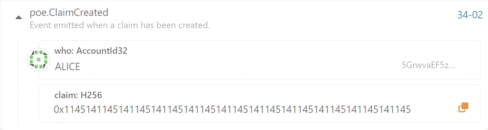
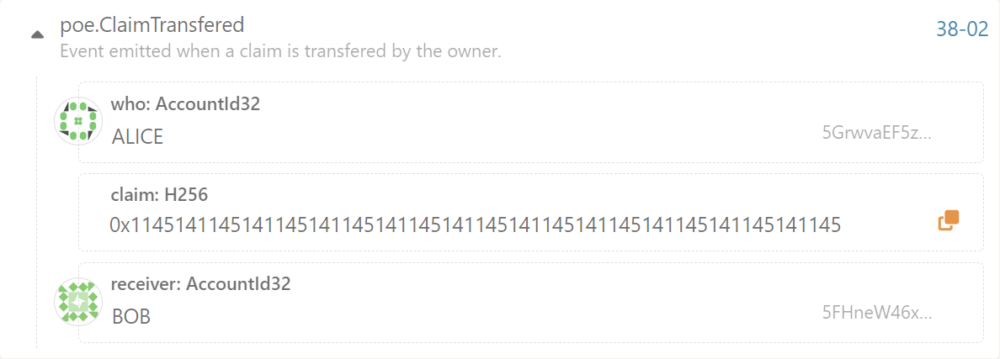
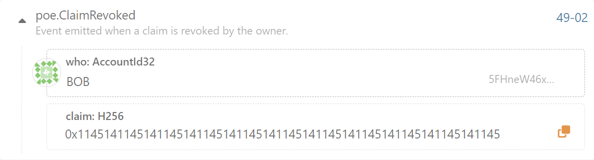

# 第五课作业

1. **列出3个常用的宏、3个常用的存储数据结构。**
   
* 三种常用的宏：frame_support::pallet、pallet::hooks、construct_runtime
* 三种常用的存储数据结构：单值存储（StorageValue）、映射（StorageMap）、双键映射（StorageDoubleMap）
   
2. **实现存证模块的功能，包括：创建存证；撤销存证。**
   
   

3. **为存证模块添加新的功能，转移存证，接收两个参数，一个是包含的哈希值，另一个是存证的接收账户地址。**
   
   
   
   创建存证：
   
   
   
   存证转移：
   
   
   
   存证销毁：
   
   

